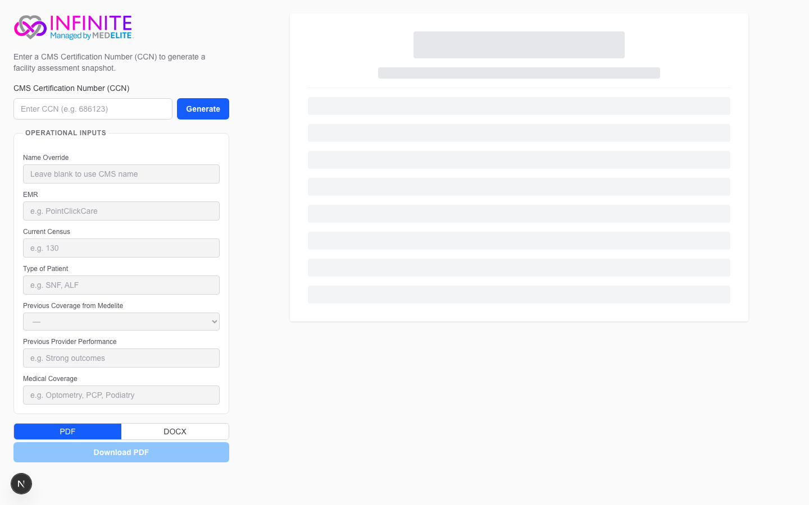
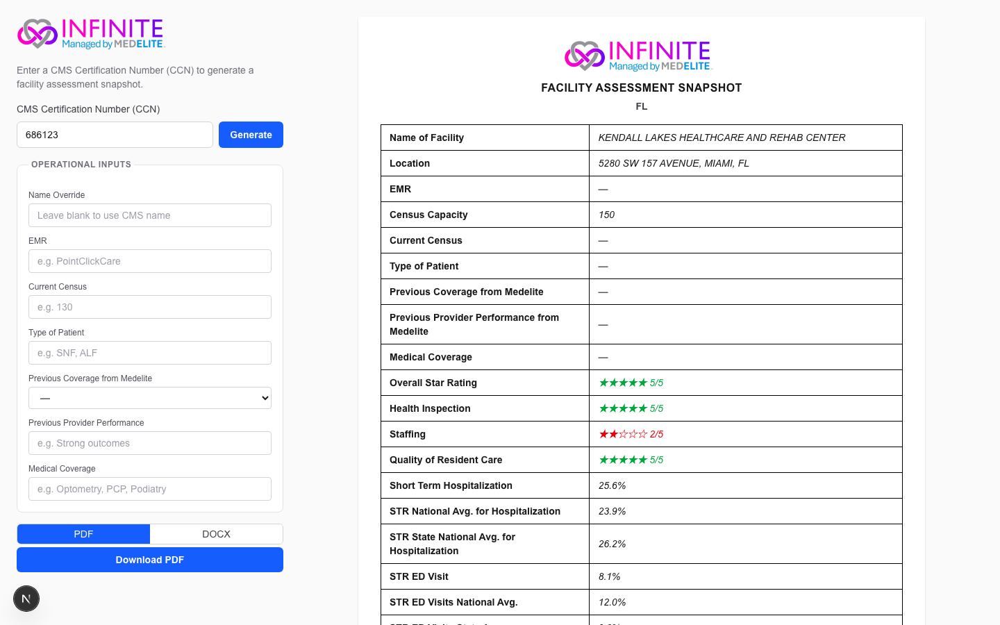
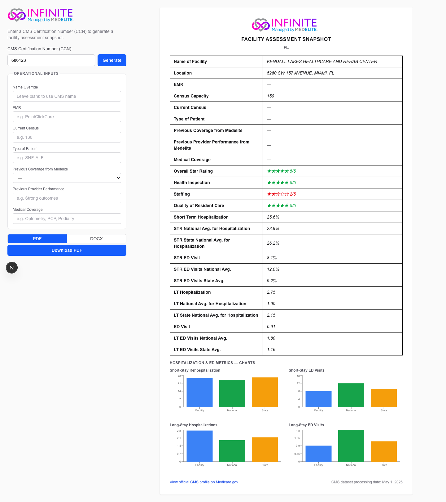

# Infinite — Facility Assessment Snapshot

A web application that turns a single CMS Certification Number (CCN) into a polished, downloadable nursing home assessment report. Enter a CCN, and the app fetches live public CMS Care Compare data, combines it with manual operational inputs, renders a live preview, and exports a print-ready PDF and Word document — each with a clickable link to the official Medicare Care Compare profile.

Built as a take-home engineering project for Medelite.

**Live deployment:** https://infinite-snapshot.vercel.app

---

## Screenshots

**Landing state — CCN input and empty report preview**



**Report loaded for CCN 686123 (Kendall Lakes Healthcare and Rehab Center, FL)**



**Full report with all metrics and comparison charts**



---

## Tech Stack

| Layer | Technology |
|-------|------------|
| Framework | Next.js 16.2.x, React 19, TypeScript strict |
| Styling | Tailwind CSS v4 |
| PDF export | `@react-pdf/renderer` v4 (server-side only; never html2canvas/jsPDF) |
| Word export | `docx` v9 |
| Validation | Zod v4 — every CMS response passes a schema before any render or export |
| Charts (web) | Recharts v2 (pinned; v3 is incompatible with the PDF chart adapter) |
| Charts (PDF) | `react-pdf-charts` — wraps Recharts SVG for react-pdf with `isAnimationActive={false}` |
| SVG rasterization | `@resvg/resvg-js` — converts chart SVG to PNG for the Word export |
| CMS data | Public CMS Provider Data Catalog REST API (three datasets, server-side fetch only) |
| Deployment | Vercel |
| Testing | Vitest v4 — 394 tests, node environment, fixture-based |

---

## Assumptions Made

The project prompt specified required report fields and a reference PDF, but left several implementation details open. The assumption I made most deliberately was around address normalization: the CMS API returns addresses in uppercase (e.g., `"5280 SW 157 AVENUE, MIAMI, FL"`), while the reference report showed title-case with ordinal suffixes (`"5280 SW 157th Ave, Miami, FL"`). I chose to display the raw composed CMS string without normalization, on the grounds that transforming regulated government data to match an illustrative example is lossy and could corrupt addresses for facilities with non-standard street names. The decision is documented in the repository and is reversible if Medelite prefers a normalized presentation. Separately, I treated the "12 hospitalization/ED metrics" as 4 measures across 3 sources (facility value, national average, state average), not 12 distinct measures — a reading confirmed by the CMS data dictionary and the three-dataset architecture required to assemble them.

---

## Tech Stack and Override Logic

The stack was chosen to satisfy the constraint that PDF generation must be server-rendered — `@react-pdf/renderer` is the only library that composes a React component tree into a PDF buffer without a headless browser. Recharts is pinned to v2 because `react-pdf-charts` (the adapter that bridges Recharts SVG output into react-pdf primitives) does not yet support v3. The facility name override works as follows: the `ManualInputsForm` component exposes a `nameOverride` text field that is optional and defaults to blank. When assembling the `ReportViewModel`, the function resolves `displayName` as `manual.nameOverride?.trim() || facility.providerName` — if the user provided a non-empty value, it takes precedence over the CMS legal name; otherwise the CMS name is used. Critically, `displayName` flows only into the report body (the "Name of Facility" table row). The header — `"INFINITE — Managed by MEDELITE"`, `"FACILITY ASSESSMENT SNAPSHOT"`, and the state abbreviation — is assembled by a separate `assembleHeader(state)` function that accepts no facility-name argument at all. TypeScript enforces this at compile time: passing a facility name to `assembleHeader` is a type error.

---

## Data Sourcing and QA Strategy

The app queries three CMS Provider Data Catalog datasets via server-side Route Handlers (browser-direct calls are blocked by CORS). The **Provider Information** dataset (`4pq5-n9py`) supplies the facility name, address components, certified bed count, and the four star ratings (`overall_rating`, `health_inspection_rating`, `staffing_rating`, `qm_rating`). The **Medicare Claims Quality Measures** dataset (`ijh5-nb2v`) supplies the four facility-level hospitalization/ED measures (short-stay rehospitalization rate, short-stay ED visit rate, long-stay hospitalization rate per 1,000 resident-days, long-stay ED visit rate per 1,000 resident-days), using the risk-adjusted score to match what Care Compare displays. The **State/US Averages** dataset (`xcdc-v8bm`) supplies the eight national and state-level averages, keyed by `state_or_nation` values `NATION` and the two-letter state code. All three datasets are queried by their stable dataset IDs, never by distribution IDs, which rotate weekly. Data integrity is enforced at the fetch boundary with a Zod schema (`CMSRowSchema`) that handles the three most common CMS encoding quirks: numeric fields are returned as strings (`"150"`, not `150`), suppressed values are empty strings (`""`, not `null`), and unknown columns must pass through untouched. Beyond the schema, a captured fixture for CCN 686123 (the reference facility) is stored in `tests/fixtures/` and used as the ground truth for all unit and integration tests — any parser change that would mutate known-good values fails the test suite before it can reach the UI or exports.

---

## Obstacles and Engineering Tradeoffs

The most significant technical hurdle was a production-only failure that only appeared after deploying to Vercel. During the Word export, Turbopack's production minifier was mangling OOXML template literals that used string concatenation (`"<w:t>" + value + "</w:t>"`), corrupting the XML and producing unreadable `.docx` files locally built with `next build --turbo`. The same code worked correctly in development. The fix required rewriting all OOXML-generating strings as single template literals (`\`<w:t>${value}</w:t>\``), which the minifier handled correctly. A second serverless-specific failure appeared in the same release: chart labels in the Word export were rendered blank on Vercel Lambda because `@resvg/resvg-js` (the SVG-to-PNG rasterizer) falls back to system fonts when no match is found, and Lambda environments provide none. Embedding a DejaVu Sans subset font directly in the project resolved it. Both bugs were invisible to local development and only surfaced under production build + serverless execution, which is why `npm run verify:full` (which runs `next build`) is a required step in the quality gate and not an optional one.

---

## Getting Started

```bash
# Clone and install
git clone https://github.com/1akashkalita/Infinite-MedElite.git
cd Infinite-MedElite/medelite-report
npm install

# Start development server
npm run dev
# Open http://localhost:3000

# Run quality gate before committing (typecheck, lint, format, tests)
npm run verify

# Full gate including production build
npm run verify:full
```

Test with CCN `686123` (Kendall Lakes Healthcare and Rehab Center, FL) to verify the complete flow against the reference fixture.
